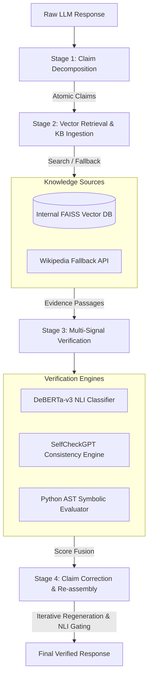

# 🔥 Hallucination Firewall

An inference-time hallucination detection and self-correction engine for Large Language Models (LLMs). This project acts as an automated, real-time guardrail to decompose, verify, and correct factual inaccuracies in LLM responses before they reach the user.

---

## 🏗️ System Design & Architecture

The **Hallucination Firewall** operates as a modular middleware layer placed between the raw output of a generator LLM and the end application. It processes text in **four sequential pipeline stages**:

### 1. Stage 1: Claim Decomposition ([decomposer.py](file:///c:/Users/RAGA%20T/hallucination-firewall/core/decomposer.py))
* **Goal**: Isolate factual statements. Verifying a long paragraph as a single block dilutes accuracy (true sentences mask false ones).
* **Workflow**: The raw LLM response is processed by a local instruction-tuned LLM (`llama3.2:1b` via Ollama) which parses the text into a clean numbered list of **atomic factual claims**.
* **Filtering**: Opinions, subjective statements, and vague generalizations are filtered out using prompt-based classification, leaving only concrete verifiable statements.

### 2. Stage 2: Evidence Retrieval & Ingestion ([knowledge_base.py](file:///c:/Users/RAGA%20T/hallucination-firewall/core/knowledge_base.py))
* **Goal**: Fetch contextually relevant grounding text for each claim.
* **Workflow**:
  1. Each claim is converted into a dense embedding vector using a local embedding model (`all-MiniLM-L6-v2`).
  2. A vector similarity search is performed against the **Internal Knowledge Base** indexed with a **FAISS** vector store.
  3. **Wikipedia Fallback**: If the top retrieval similarity score falls below a threshold (default `0.30`), the system executes a real-time Wikipedia search using the claim's core query, retrieves the matching page summary, calculates its semantic similarity to the claim, and uses it as evidence if it exceeds `0.72` similarity.
  4. **Active KB Expansion**: If enabled, claims categorized as `UNVERIFIABLE` trigger background scraping queries to automatically grow the internal knowledge corpus.

### 3. Stage 3: Multi-Signal Verification ([verifier.py](file:///c:/Users/RAGA%20T/hallucination-firewall/core/verifier.py))
Fuses three independent verification signals to minimize false positives and capture different types of hallucinations:
* **Natural Language Inference (NLI) ([nli_scorer.py](file:///c:/Users/RAGA%20T/hallucination-firewall/core/nli_scorer.py))**: Uses a cross-encoder model (`nli-deberta-v3-small`) to classify the relationship between the retrieved evidence (premise) and the claim (hypothesis) into three categories:
  * **SUPPORTED** (Entailment)
  * **CONTRADICTED** (Contradiction)
  * **NEUTRAL** (Unrelated / Unprovable)
* **SelfCheck (Consistency Checking) ([selfcheck.py](file:///c:/Users/RAGA%20T/hallucination-firewall/core/selfcheck.py))**: Inspired by *SelfCheckGPT*, the engine queries the local LLM multiple times (default 3x) at a higher temperature (`0.7`) to answer: *"Is this claim factually correct? (yes/no)"*. Inconsistent or split votes (e.g. 1 yes, 2 nos) signal a hallucination.
* **Symbolic Logic Evaluator ([symbolic.py](file:///c:/Users/RAGA%20T/hallucination-firewall/core/symbolic.py))**: Parses numerical claims, mathematical statements, and date chronologies into safe Python code. The Python abstract syntax tree (AST) is parsed and validated against a whitelist of safe nodes (no variables or functions allowed) and executed deterministically. This catches mathematical/chronological errors (e.g., *"born in 1990, died 20 years later in 2005"* -> `assert 1990 + 20 == 2005` which fails).

**Score Fusion Logic (`fuse_scores`)**:
A weighted fusion function aggregates NLI signal ($60\%$) and SelfCheck consistency score ($40\%$) into a single score. If the fused score is $\ge 0.65$, it is labeled `SUPPORTED`. If $\le 0.35$, it is labeled `HALLUCINATED`. Otherwise, it is flagged as `UNVERIFIABLE`.

### 4. Stage 4: Claim Correction & Re-assembly ([regenerator.py](file:///c:/Users/RAGA%20T/hallucination-firewall/core/regenerator.py))
* **Goal**: Rewrite incorrect claims rather than just blocking them.
* **Workflow**:
  1. Claims labeled `SUPPORTED` are passed through unchanged.
  2. Claims labeled `HALLUCINATED` are rewritten by the LLM using **only** the facts present in the retrieved evidence (strict grounding prompt).
  3. **Iterative Verification Gating**: The rewritten claim is sent back to the NLI Scorer. If the NLI Scorer does not verify the rewrite as `SUPPORTED` (confidence $\ge 0.65$) within 2 attempts, the correction fails, and the system falls back to adding an unverified warning.
  4. Claims labeled `UNVERIFIABLE` are prepended with an honest warning tag: `[Unverified] <Original Claim>`.
  5. The final clean paragraph is reconstructed using the corrected/warning-attached sentences.

---

## 🛠️ Technology Stack & Justification

| Technology | Role | Choice Justification |
| :--- | :--- | :--- |
| **Python 3.10+** | Core Programming Language | Standard for ML and LLM orchestration; provides native AST manipulation. |
| **FastAPI** | Backend Web API | Asynchronous endpoints, automatic OpenAPI documentation, high concurrency support via `asyncio`. |
| **Streamlit** | Frontend Demo App | Enables rapid prototyping of complex data flows without writing Javascript or HTML. |
| **Ollama** | Local LLM Server | Serves open-source models (`llama3.2:1b` or `llama3.1`) locally to ensure data privacy, offline capabilities, and zero API costs. |
| **FAISS** (`faiss-cpu`) | Vector Store / Similarity Search | In-memory, extremely fast inner product flat index (`IndexFlatIP`). No database hosting fees or external network hops required. |
| **Sentence-Transformers** (`all-MiniLM-L6-v2`) | Text Embeddings | Light-weight (90MB), runs on CPU, and yields excellent semantic mapping for retrieval. |
| **Transformers** (`nli-deberta-v3-small`) | Natural Language Inference | Compact DeBERTa model specifically trained for NLI. Provides higher accuracy than general-purpose LLMs on raw logical entailment tasks at a fraction of the cost. |
| **HuggingFace `datasets`** | Evaluation | Used to stream the HaluEval benchmarking dataset to test precision/recall. |

### Architectural Design Trade-Offs

#### 1. Why DeBERTa-v3 for NLI instead of a large LLM (e.g. GPT-4)?
* **Cost & Latency**: Running DeBERTa-v3 locally takes $<10\text{ms}$ on CPU and is completely free. Querying GPT-4 for NLI classification would cost dollars and take $1\text{-}2$ seconds per claim.
* **Reliability**: Generative LLMs are prone to instruction-drift and formatting errors. Cross-encoder NLI models output exact probability distributions over three indices, making them deterministic, stable, and highly tuned for logic classification.

#### 2. Why local Ollama instead of OpenAI's API?
* **Privacy & Security**: Raw enterprise data (knowledge bases and prompts) never leaves the local machine.
* **Cost Efficiency**: Consistency checking requires sampling the model 3 to 5 times per claim. If an LLM response contains 10 claims, that is 30-50 API calls per query. Doing this on paid APIs is cost-prohibitive.

#### 3. Why FAISS Flat Inner-Product (IndexFlatIP) instead of HNSW or Pinecone?
* **Dataset Scale**: For a localized knowledge base ($<100,000$ documents), a flat index performs exhaustive search in less than a millisecond. 
* **Zero Overhead**: Flat indices require zero clustering parameters to tune and require no external cloud database connections, removing network latency bottlenecks.

---

## 🚀 Performance Optimizations & Caching

To make the pipeline viable for real-time applications, three optimization strategies are implemented:

1. **Dual-Layer Caching**:
   * **Response Cache ([pipeline.py](file:///c:/Users/RAGA%20T/hallucination-firewall/pipeline.py))**: Hashes the input prompt, target LLM response, and model configurations. If a user inputs the exact same text again, the firewall bypasses all stages and returns the result in $<1\text{ms}$.
   * **Claim Cache ([verifier.py](file:///c:/Users/RAGA%20T/hallucination-firewall/core/verifier.py))**: Implements an LRU (Least Recently Used) cache for verified claims. Since LLMs repeat common factual errors (e.g., *"Guido van Rossum released Python in 1995"*), individual claims are cached to avoid repeating NLI and SelfCheck runs.
2. **Asynchronous Concurrency**:
   * Consistency checks run in parallel. Instead of waiting for 3 sequential local LLM runs, `check_claim_consistency_async` fires concurrent requests to Ollama using `asyncio.gather` and manages execution speed with a semaphore (`max_concurrent=4`).
3. **Lazy Model Loading**:
   * Heavy models (Embedding Model, DeBERTa NLI cross-encoder) are loaded as **singletons** only when needed (`NLIModelRegistry`). They are kept in RAM for subsequent requests, preventing startup latency on API calls.

---

## 📈 Evaluation & Benchmarking ([evaluate.py](file:///c:/Users/RAGA%20T/hallucination-firewall/eval/evaluate.py))

To ensure the firewall actually catches hallucinations without introducing excessive false positives, it is benchmarked against the **HaluEval** dataset (from HuggingFace).

### Evaluation Dataset Structure
HaluEval provides triplets:
* `Question`: The user input prompt.
* `Right Answer`: A factually correct response.
* `Hallucinated Answer`: A response injected with realistic human-annotated factual errors.

### Metrics Calculated
$$\text{Precision} = \frac{\text{True Positives (actual hallucinations caught)}}{\text{Total Flagged As Hallucinated}}$$
$$\text{Recall} = \frac{\text{True Positives (actual hallucinations caught)}}{\text{Total Actual Hallucinations}}$$
$$\text{F1 Score} = 2 \times \frac{\text{Precision} \times \text{Recall}}{\text{Precision} + \text{Recall}}$$
$$\text{Accuracy} = \frac{\text{Correct Classifications}}{\text{Total Samples}}$$
